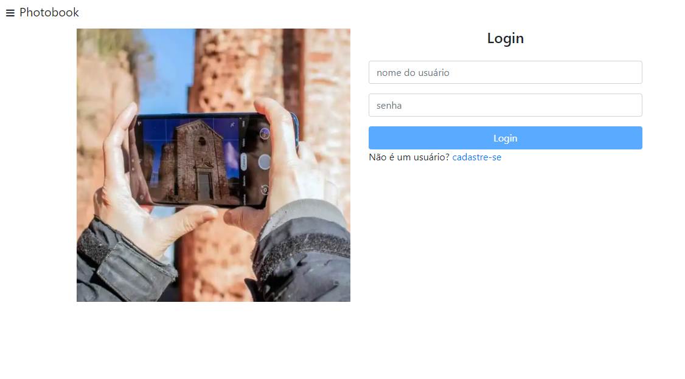

# PhotoBook

This project was generated with [Angular CLI](https://github.com/angular/angular-cli) version 10.1.6.

## Development server

Run `ng serve` for a dev server. Navigate to `http://localhost:4200/`. The app will automatically.

Run `npm start` for API.  

Created users: 
user: alvaro, password: 12345678  
user: alex, password: 123

##

